# Hello Robot Workshop

Welcome to the Hello Robot Workshop! In this workshop, we will cover various robotics topics such as control systems, kinematics, and robot simulations using MATLAB. Please follow the instructions below to get started with MATLAB installations, inverted pendulum balancing, kinematics, and robot simulations.

Slides for the session : [Download PDF](slides.pdf)

---

### Steps for Installation:
1. **Download MATLAB**:
   - Go to [MathWorks Download Page](https://www.mathworks.com/downloads).
   - Choose the appropriate version for your operating system (Windows, macOS, or Linux).
   
2. **Create a MathWorks Account** (if you don't have one):
   - Sign up at [MathWorks Account](https://www.mathworks.com/help/matlab/matlab_external/create-a-mathworks-account.html) using your **LDAP ID**
   
3. **Run the MATLAB Installer**:
   - After downloading, run the installer and follow the on-screen instructions.

4. **Install Additional Toolboxes** :
   You will be asked to select products to be installed, So over there you need to tick on the following Add Ons: 

    - Matlab
    - Simulink 
    - Simscape
    - Simscape Multibody
    - Simulink 3D animation 
 

6. **Activate MATLAB**:
   - Once installation is complete, open MATLAB and activate it using your MathWorks account.

---

# Activity

## Pick and Place Mechanism 

### Instructions to open the Simulink Model in MATLAB

1. Download the Zip file of repository using the green colored (CODE) button. 
2. Extract the files into a folder. 
3. In Current Folders Section in Matlab, Right Click on your folder and select 'Add to Path/Selected Folders and Subfolders'
4. Open Folder/Examples/3D/Gripper2_Belts/Gripper2_Belts.slx file

#### Gripper2_Belts.slx file 
In this activity we are going to make a pick and place mechanism based robotic arm model. After you have went through all the instructions in the session and followed this repo carefully, you will end with this:

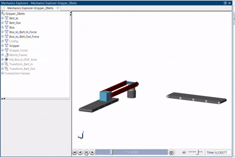

---

We have provided you with some blocks required for simulating the model. There are no connections made into it and when you run this file, Your matlab will be flooded with errors. So lets get into making this work! 
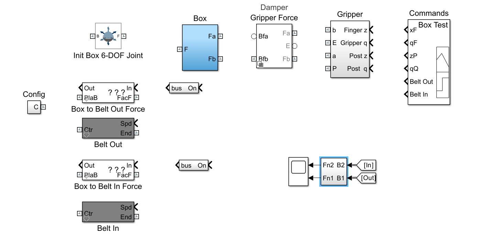

### Gripper 
The gripper consists of two plate-like structures that move closer to grip an object and farther apart to release it. Linear motion is achieved through prismatic joints, which are supported by a rod and post mechanism. The rod transfers motion, while the post stabilizes the prismatic joints. The base anchors the entire assembly, ensuring stable operation. This design is ideal for tasks like pick-and-place, where precise control is required to securely handle and transfer objects.

You are provided with the following:
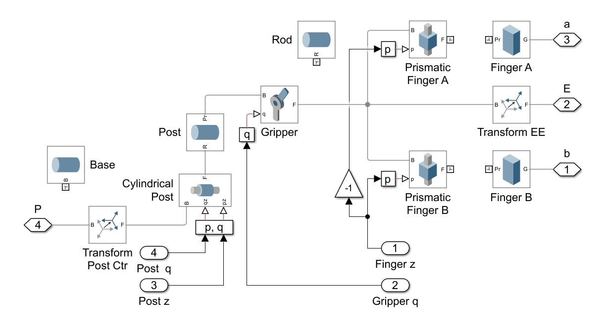

Hope you got a good understanding about how this gripper work, Check for the connections in the gripper block. This should be the final gripper model:

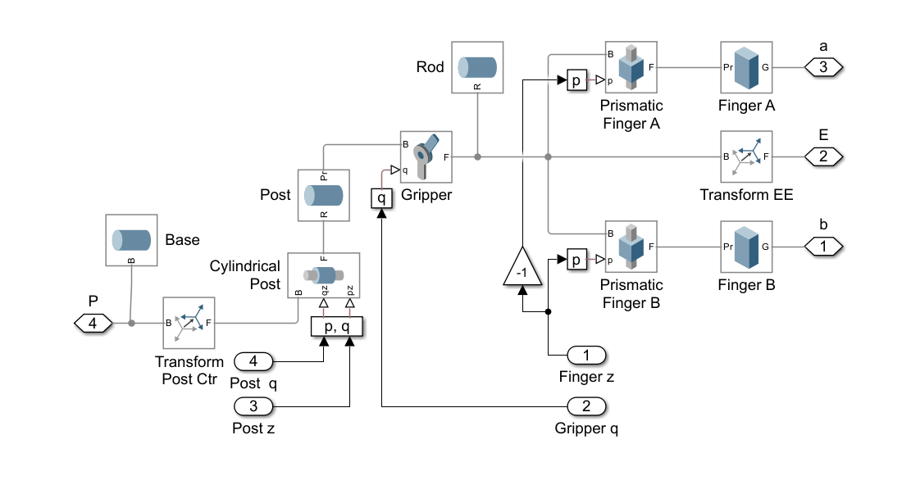

### Conveyer Belt 
The Gripper Model Block in MATLAB simulates a gripper with rollers linked to revolute joints. These joints allow the rollers to rotate, and the transform rollers manage the positional adjustments. The model takes speed as input, which controls the rotation of the rollers, simulating the gripper’s movement for tasks like object manipulation.

The Belt Out Box given to you has some incomplete connections. 
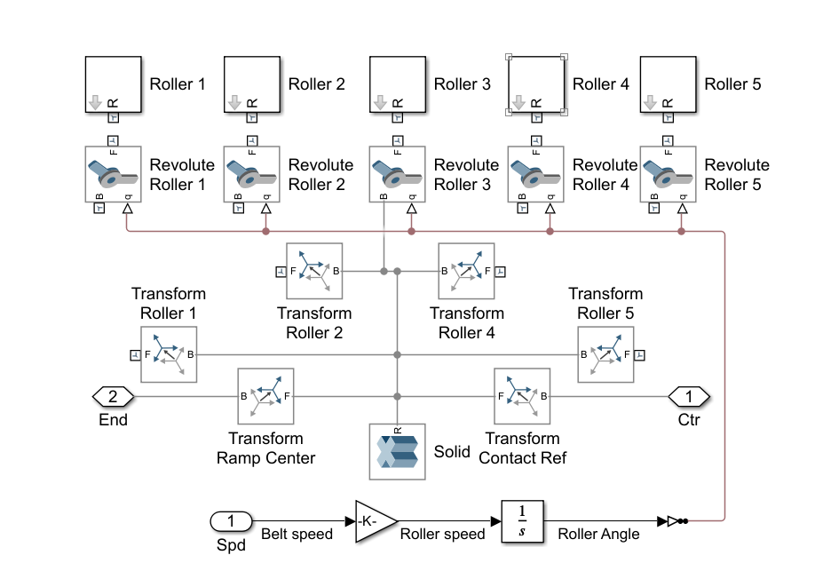

Complete the following Connections:
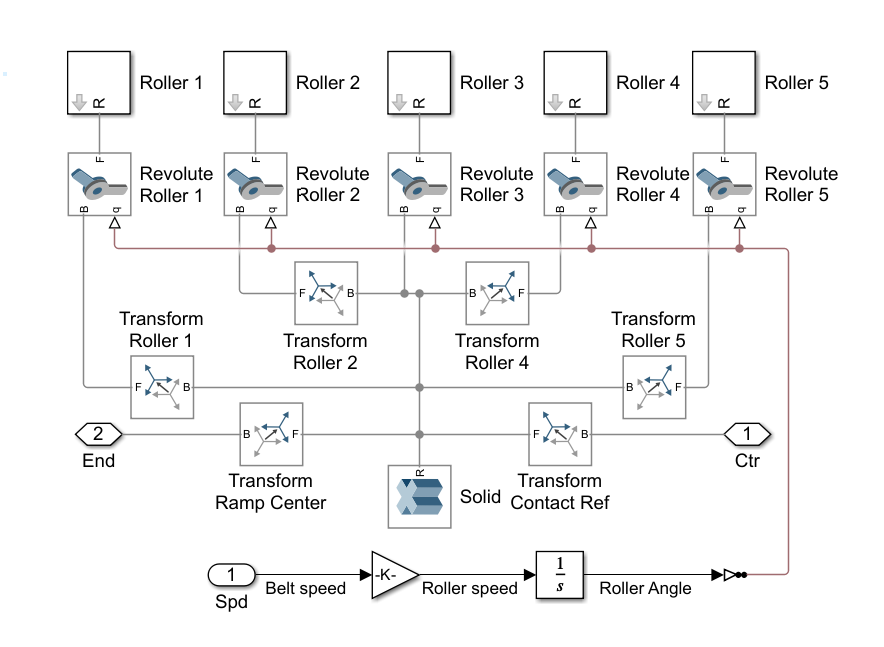

The Belt In Block works on similar principle, You don't need to do any changes to that.

So, this was about some major modelling related part of the belt and gripper.
Now we will move on to adding some Blocks on own. For this you need to use the Library Browser at the top tab area in Matlab. You can search for any component and add it to your simulink model and drag or double click. 

#### World Frame: 
- Search for "world frame" in the library browser and add it you slx file.

### Transform Block:
A Transform block in Simulink adjusts the position and orientation of an object or coordinate frame.

- Entry belt: Requires a -90° rotation to align with the 90° turn of the system.
- Exit belt: Requires a 180° flip because the material exiting the incoming belt is reversed and turned to flow correctly on the outgoing belt.

- Offsets in translation refer to the positional shift or displacement of an object or point relative to a reference coordinate system or origin. In simple terms, they define how far an object is moved along the X, Y, and Z axes from a starting position.

#### Transform Belt Out 

- Search for "rigid transform", add it your model and name it as "Transform Belt Out".
- Double Click on the Block and do the following changes: 
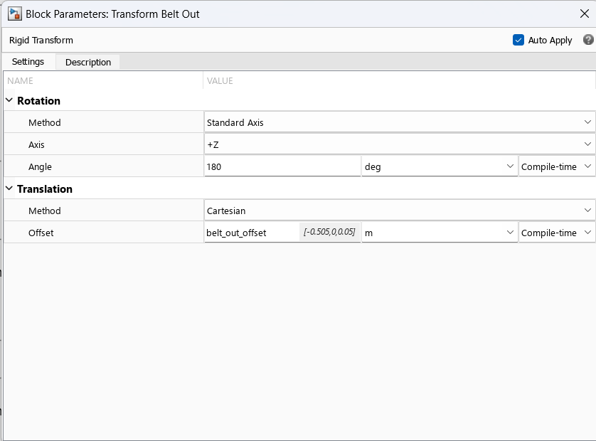
  
#### Transform Belt In

- Search for "rigid transform", add it your model and name it as "Transform Belt In".
- Double Click on the Block and do the following changes: 
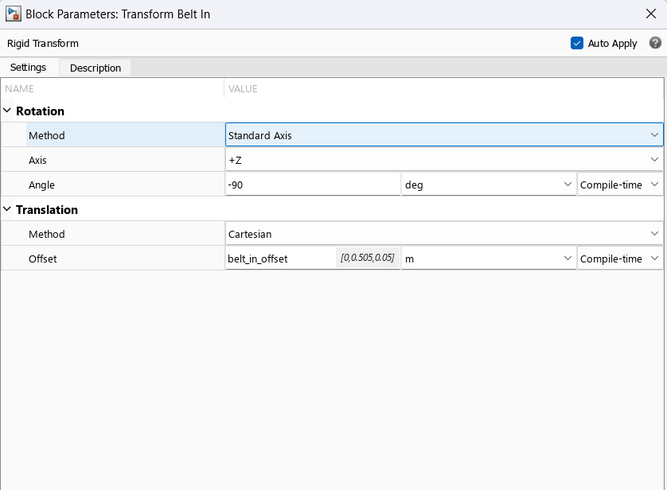

### Goto Blocks

#### Goto
The Goto block in MATLAB is used in Simulink to transfer signals between different parts of a model. It allows you to send a signal from one block to another, even if the blocks are not directly connected. The Goto block helps improve model readability by avoiding long, tangled lines of connections.

- Search for Goto in the library browser, place it in the simulink model as name "Goto".
- Double Click on the Block and do the following changes:
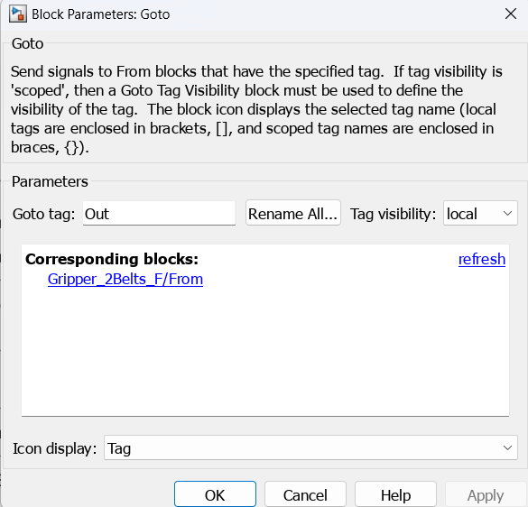

#### Goto1
- Search for Goto in the library browser, place it in the simulink model as name "Goto1".
- Double Click on the Block and do the following changes:
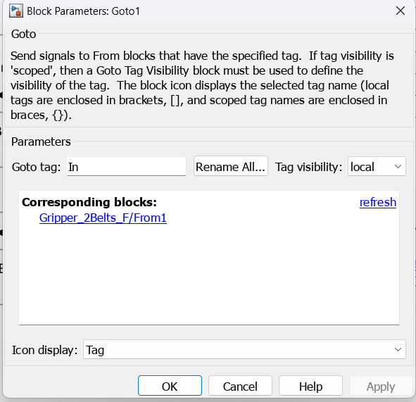

Now, we will make the connections within all these Blocks. Refer the following:
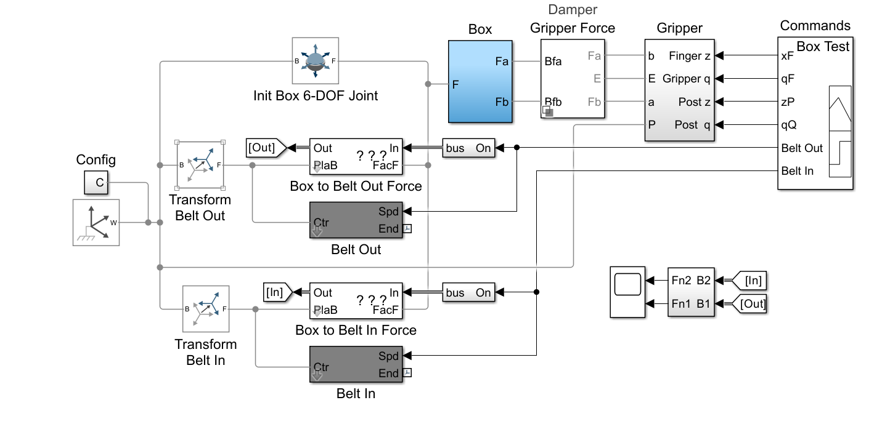

Click on the **Run** Button at the top, the Simulation will start. 

The slx file with all connections made is given : [Download Simulink File](Gripper_2Belts_F.slx)

We Hope you guys enjoyed :) 

